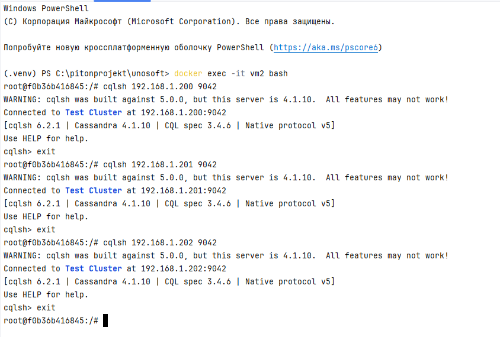
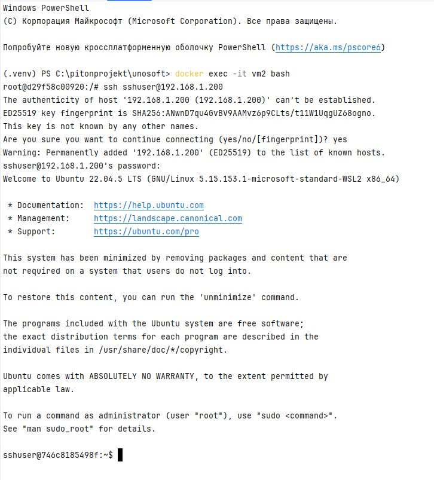

### ТЗ
https://github.com/PeacockTeam/new-job/blob/master/DevOps-Docker.md

Создать Docker Compose скрипт для развертки кластера из трех инстансов cassandra, 
причем каждый из них должен быть доступен из основной (локальной) сети по отдельному ip адресу.
Задание

    На машине А (ubuntu 24.04 lts) в локальной сети с ip 192.168.1.197 запускается скрипт docker-compose для поднятия 3 образов с ip адресами 192.168.1.200-202.
    Затем с машины Б (ubuntu 24.04 lts) из той же локальной сети с ip 192.168.1.198 необходимо подключиться через cqlsh к каждой из машин-образов.
    Настроить ssh для возможности подключения к 1.200 с 1.197
    Все приведённые операции необходимо задокументировать и описать инструкцией с командами и объяснениями в Readme
    Добавить скриншот результата в Readme.

### Задание выполнено на windows в докере

### Сделай файл .env пример заполнения в  .env.example

### Проверь конфликтующие сети 
проверь существующие докер сети

    docker network ls

найди сеть с подсетью 192.168.1.0/24

    docker network inspect <NETWORK_ID_OR_NAME> | Select-String "Subnet"

удали конфликтующую сеть

    docker network rm <NETWORK_NAME_OR_ID>

### Запусти докер контейнеры

создай контейнер

    docker-compose build
запусти контейнер

    docker-compose up

что здесь происходит?

    создаётся сеть 192.168.1.0/24
    создаётся контейнер vm1 с ip 192.168.1.197 на этой вм устанавливается кассандра
    создаётся контейнер vm2 с ip 192.168.1.198 с этой вм будем заходить на вм1

vm1

    устанавливается докер
    копируются докерфайлы для кассандры
    запускается шелл скрипт, который в докере запускает кассандру
    в кассандре устанавливается 3 ноды. каждой ноде назначается свой ip
    ноды видны в сети 192.168.1.0/24
    в ноде1 устанавливается приложение для ssh  и создаётся пользователь
    пароль берётся из .env-а
    запускается ssh сервер и сервер кассандры

vm2

    устанавливается cqlsh (консольный клиент для взаимодействия с кассандрой)
    
### Проверка 

зайди в терминале

    docker exec -it vm2 bash

подключись к нодам

    cqlsh 192.168.1.200 9042
    cqlsh 192.168.1.201 9042
    cqlsh 192.168.1.202 9042

подключаемся через ssh

    ssh sshuser@192.168.1.200

### удалить контейнер

    docker-compose down

